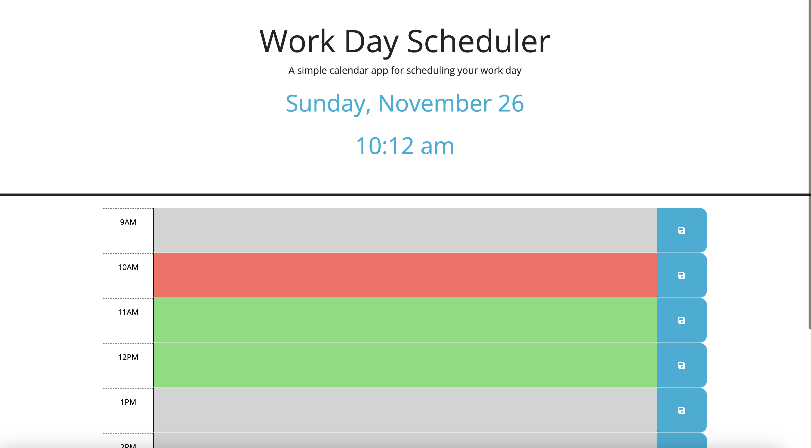
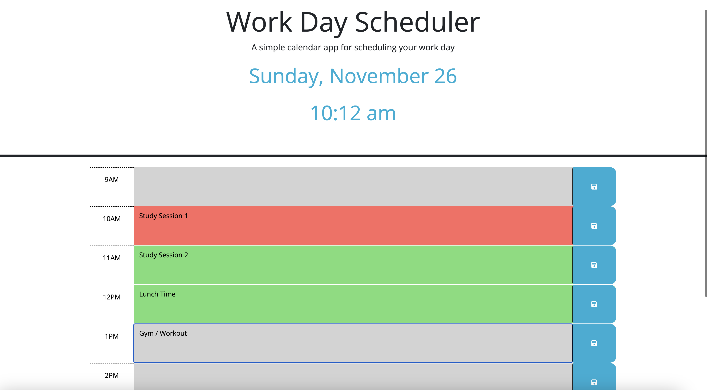

# Work-day-Schedule

## Description

In our daily tasks and responsibilities, it's easy to get overwhelmed. Having a professional workday scheduler solution to help you organize your tasks and maintain focus. Being able to jot down and manage your responsibilities on a dedicated webpage, ensuring a clear and organized approach to your day!

What have I learned?
- Knowing how to save User's data in Local Storage and being able to pull it display it on the webpage
- Learned how to use and work with DayJS

## Image(s) & Usage
1. Locate the Text-Area:
Look for the dedicated text-area where you can input your tasks and responsibilities. It's usually a blank space where you can type.

2. Click on the Text-Area:
Using your mouse or touchpad, click on the text-area to activate it. This allows you to start typing.

3. Input Tasks and Responsibilities:
Begin typing your tasks and responsibilities for the day into the text-area.

4. Review and Edit (if needed):
Take a moment to review the tasks you've entered. If necessary, edit the text to make sure everything is accurate and well-organized.

5. Locate the SAVE Icon:
Look for the SAVE icon on the right side of the page.

6. Click the SAVE Icon:
Click on the SAVE icon to save your input. This action stores your tasks and responsibilities so you can access them later.

## Features

User Interface (UI):
- Being able to enjoy a user-friendly interface designed for simplicity and efficiency, providing a seamless navigation experience.

Task Management:
- Effortlessly organize your tasks with our intuitive task management system, allowing you to stay on top of your to-do list throughout your day.

Auto-Save Functionality:
- Experience a peace of mind with our auto-save functionality! Never worry about losing your task updates or changes again. Your progress is automatically saved in real-time, ensuring that when you return later, your page reloads with all your latest edits intact. Enjoy a seamless and worry-free user experience, focusing on your tasks without the fear of data loss.

## Link(s)
Deployed Application: https://lifewawj.github.io/Work-day-Schedule/ 
